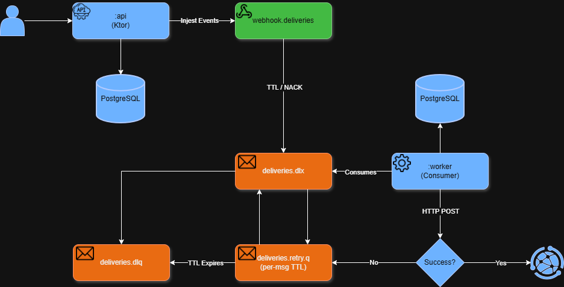

# WebhookHub

WebhookHub is a webhook ingestion and delivery system built on Kotlin JVM.
It receives signed HTTP webhook events, persists them, and delivers them asynchronously to configured HTTP destinations with automatic retries and a dead-letter queue for failed deliveries.

---

## Architecture



**Modules**

| Module | Responsibility |
|---|---|
| `:shared` | Queue message models (`DeliveryJob`), environment config (`EnvConfig`), shared JSON instance (`AppJson`), RabbitMQ topology declaration |
| `:api` | Ktor server — webhook ingestion (HMAC validation, idempotency, delivery scheduling), source and destination management, Flyway migrations, RabbitMQ topology init |
| `:worker` | RabbitMQ consumer — HTTP delivery to destination URLs, retryable/non-retryable error classification, exponential-backoff retry via `deliveries.retry.q`, delivery state persistence (DELIVERED / RETRYING / DEAD), DLQ routing via `deliveries.dlx` |

**Persistence** — Postgres is the source of truth for all delivery state, idempotency keys, and audit history.
**Transport** — RabbitMQ is used exclusively as execution transport, not state storage.

---

## Design decisions

| Decision | Document |
|---|---|
| Why split into API, Worker, and Shared? | [design-module-split.md](docs/design-module-split.md) |
| Why feature-based packages rather than layer-based? | [design-feature-based-packages.md](docs/design-feature-based-packages.md) |
| Why the Use Case layer? | [design-use-case-layer.md](docs/design-use-case-layer.md) |
| Why repository interfaces? | [design-repository-interfaces.md](docs/design-repository-interfaces.md) |
| Why Ktor instead of Spring? | [design-ktor-over-spring.md](docs/design-ktor-over-spring.md) |
| Why Exposed instead of JPA/Hibernate? | [design-exposed-over-jpa.md](docs/design-exposed-over-jpa.md) |
| Why PostgreSQL as source of truth and RabbitMQ only as transport? | [design-postgres-source-of-truth.md](docs/design-postgres-source-of-truth.md) |

---

## Prerequisites

- Docker and Docker Compose
- JDK 21 (auto-downloaded via Gradle Foojay toolchain if not present)
- Gradle (via wrapper — no global install needed)

---

## How to run locally

**1. Start infrastructure**

```bash
docker-compose up -d
```

| Service | URL | Credentials |
|---|---|---|
| Postgres | `localhost:5432` | `webhookhub` / `webhookhub` |
| RabbitMQ AMQP | `localhost:5672` | `webhookhub` / `webhookhub` |
| RabbitMQ Management UI | http://localhost:15672 | `webhookhub` / `webhookhub` |
| PGAdmin | http://localhost:5050 | `admin@webhookhub.com` / `admin` |
| Jaeger UI | http://localhost:16686 | — |
| OTel Collector (gRPC) | `localhost:4317` | — |
| OTel Collector (HTTP) | `localhost:4318` | — |

**2. Set environment variables**

```bash
export DB_URL=jdbc:postgresql://localhost:5432/webhookhub
export DB_USER=webhookhub
export DB_PASSWORD=webhookhub

export RABBITMQ_HOST=localhost
export RABBITMQ_PORT=5672
export RABBITMQ_USER=webhookhub
export RABBITMQ_PASSWORD=webhookhub
export RABBITMQ_VHOST=webhookhub
```

**3. Run the API**

```bash
./gradlew :api:run
```

The API starts on `http://localhost:8080`.

Tracing is enabled automatically via the OpenTelemetry Java agent. Traces are exported to the OTel Collector at `http://localhost:4317` and forwarded to Jaeger. View traces at http://localhost:16686.

To disable tracing or point at a different collector:

```bash
OTEL_TRACES_EXPORTER=none ./gradlew :api:run
OTEL_EXPORTER_OTLP_ENDPOINT=http://my-collector:4317 ./gradlew :api:run
```

**4. Run the Worker**

```bash
./gradlew :worker:run
```

Same OTel defaults apply — override with `OTEL_SERVICE_NAME`, `OTEL_EXPORTER_OTLP_ENDPOINT`, or `OTEL_TRACES_EXPORTER=none`.

---

## API Endpoints

### Health

```
GET /health
```

Returns database connectivity status and HikariCP connection pool statistics.

**Response `200 OK`**
```json
{
  "status": "UP",
  "db": "UP",
  "pool": {
    "total": 10,
    "active": 1,
    "idle": 9,
    "pending": 0
  }
}
```

Returns `503 Service Unavailable` with `"status": "DOWN"` if the database is unreachable.

---

### Sources

Sources represent external systems that send webhook events. Each source has a unique name and a generated HMAC secret used to verify incoming payloads.

#### Create a source

```
POST /sources
Content-Type: application/json
```

```json
{ "name": "github" }
```

**Response `201 Created`** — includes `hmacSecret` (shown only at creation time)
```json
{
  "id": "f47ac10b-58cc-4372-a567-0e02b2c3d479",
  "name": "github",
  "hmacSecret": "a3f1c2...",
  "active": true,
  "createdAt": "2026-02-18T10:00:00Z"
}
```

Returns `400 Bad Request` if `name` is blank or exceeds 100 characters.

#### List sources

```
GET /sources
```

**Response `200 OK`** — `hmacSecret` is not exposed in this endpoint
```json
[
  {
    "id": "f47ac10b-58cc-4372-a567-0e02b2c3d479",
    "name": "github",
    "active": true,
    "createdAt": "2026-02-18T10:00:00Z"
  }
]
```

---

### Destinations

Destinations are HTTP endpoints that receive webhook events. Each destination is created with one or more routing rules that determine which source/event-type pairs are delivered to it.

#### Create a destination

```
POST /destinations
Content-Type: application/json
```

```json
{
  "name": "my-service",
  "targetUrl": "https://my-service.example.com/webhook",
  "rules": [
    { "sourceName": "github", "eventType": "push" }
  ]
}
```

At least one rule is required. Returns `400 Bad Request` if `name` is blank or exceeds 100 characters, `targetUrl` is not a valid HTTP/HTTPS URL, or `rules` is empty.

**Response `201 Created`**
```json
{
  "id": "a1b2c3d4-...",
  "name": "my-service",
  "targetUrl": "https://my-service.example.com/webhook",
  "active": true,
  "createdAt": "2026-02-19T10:00:00Z",
  "rules": [
    { "id": "e5f6...", "sourceName": "github", "eventType": "push" }
  ]
}
```

#### List destinations

```
GET /destinations
```

**Response `200 OK`** — each destination includes its rules

#### Get a destination

```
GET /destinations/{id}
```

**Response `200 OK`** — destination with its rules.
Returns `404 Not Found` if the destination does not exist.

#### Add a rule to a destination

```
POST /destinations/{id}/rules
Content-Type: application/json
```

```json
{ "sourceName": "stripe", "eventType": "charge.created" }
```

**Response `201 Created`**
```json
{ "id": "f7a8...", "sourceName": "stripe", "eventType": "charge.created" }
```

Returns `404 Not Found` if the destination does not exist. Returns `400 Bad Request` if `sourceName` or `eventType` is blank.

---

### Ingest

Receives a webhook event from a registered source, validates its HMAC-SHA256 signature, persists the event, creates a `PENDING` delivery record for each matching destination, and publishes a `DeliveryJob` to RabbitMQ for asynchronous delivery.

#### Ingest a webhook event

```
POST /ingest/{sourceName}?type={eventType}
X-Signature: <hex-encoded HMAC-SHA256(secret, raw-request-body)>
Content-Type: application/json
```

The raw request body is forwarded as-is to the destination. The `type` query parameter identifies the event type and is used to match destination routing rules.

**Response `202 Accepted`** — event accepted and queued for delivery

| Error | Condition |
|---|---|
| `400 Bad Request` | `type` query parameter is missing or blank |
| `401 Unauthorized` | `X-Signature` header is missing, blank, or does not match `HMAC-SHA256(secret, body)` |
| `401 Unauthorized` | Source exists but is inactive |
| `404 Not Found` | No source registered under `{sourceName}` |
| `409 Conflict` | Event with the same idempotency key was already ingested |

---

### Events

#### Get an event

```
GET /events/{id}
```

**Response `200 OK`**
```json
{
  "id": "d4e5f6...",
  "sourceName": "github",
  "type": "push",
  "idempotencyKey": "abc123",
  "correlationId": "f1e2d3...",
  "createdAt": "2026-02-22T10:00:00Z",
  "payload": "{\"ref\":\"main\"}"
}
```

Returns `404 Not Found` if the event does not exist.

#### List events

```
GET /events
```

| Query parameter | Type | Default | Description |
|---|---|---|---|
| `sourceName` | string | — | Filter by source name (exact match) |
| `type` | string | — | Filter by event type (exact match) |
| `status` | `PENDING` \| `DELIVERED` \| `RETRYING` \| `DEAD` | — | Filter by the delivery status of at least one delivery record |
| `dateFrom` | ISO-8601 instant | — | Include events received at or after this time |
| `dateTo` | ISO-8601 instant | — | Include events received at or before this time |
| `page` | int | `1` | 1-based page number |
| `pageSize` | int | `20` | Results per page (max `100`) |

**Response `200 OK`**
```json
{
  "totalCount": 42,
  "page": 1,
  "pageSize": 20,
  "items": [ { "id": "...", "sourceName": "..." } ]
}
```

Returns `400 Bad Request` for an invalid `status` value or a malformed `dateFrom`/`dateTo` instant.

---

### Deliveries

#### Get a delivery

```
GET /deliveries/{id}
```

**Response `200 OK`**
```json
{
  "id": "a1b2c3...",
  "eventId": "d4e5f6...",
  "destinationId": "g7h8i9...",
  "status": "DELIVERED",
  "attempts": 1,
  "lastError": null,
  "createdAt": "2026-02-22T10:00:00Z",
  "deliveredAt": "2026-02-22T10:00:01Z"
}
```

Returns `404 Not Found` if the delivery does not exist.

#### List deliveries

```
GET /deliveries
```

| Query parameter | Type | Default | Description |
|---|---|---|---|
| `status` | `PENDING` \| `DELIVERED` \| `RETRYING` \| `DEAD` | — | Filter by delivery status |
| `eventId` | UUID | — | Filter by parent event ID |
| `page` | int | `1` | 1-based page number |
| `pageSize` | int | `20` | Results per page (max `100`) |

**Response `200 OK`**
```json
{
  "totalCount": 5,
  "page": 1,
  "pageSize": 20,
  "items": [ { "id": "...", "eventId": "...", "status": "PENDING" } ]
}
```

Returns `400 Bad Request` for an invalid `status` value or a malformed `eventId`.

---

### Error responses

Every error from the API returns a consistent JSON body regardless of the endpoint:

```json
{
  "status": 409,
  "error": "Conflict",
  "message": "duplicate event: idempotency key already exists",
  "correlationId": "f1e2d3c4-...",
  "timestamp": "2026-02-22T10:00:00.000000000Z"
}
```

| Field | Description |
|---|---|
| `status` | HTTP status code as an integer |
| `error` | Standard HTTP status description |
| `message` | Human-readable detail from the thrown exception |
| `correlationId` | Per-request correlation ID (present on ingest requests; `null` elsewhere) |
| `timestamp` | ISO-8601 instant at which the error was generated |

| Status | Cause |
|---|---|
| `400 Bad Request` | Validation failure (`IllegalArgumentException`, Ktor `BadRequestException`) |
| `401 Unauthorized` | Authentication failure (`UnauthorizedException`) |
| `404 Not Found` | Resource not found (`NotFoundException`) or unmatched route |
| `409 Conflict` | Duplicate event (`DuplicateEventException`) |
| `405 Method Not Allowed` | HTTP method not supported on the matched route |
| `500 Internal Server Error` | Any unhandled `Throwable` |

---

## How to test

**Unit tests** (no Docker required)

```bash
./gradlew :api:test --tests "*UseCaseTest" --tests "*RoutesTest"
```

**API integration tests** (requires Docker for Testcontainers)

```bash
./gradlew :api:test
```

**Worker integration tests** (requires Docker for Testcontainers)

```bash
./gradlew :worker:test
```

Exercises the full retry/DLQ flow end-to-end: PostgreSQL and RabbitMQ spin up via Testcontainers; a JDK `HttpServer` acts as the webhook target with controlled response codes per attempt.

Testcontainers automatically pulls and manages all containers. No running infrastructure needed.

**Full test suite**

```bash
./gradlew test
```

**Full clean build**

```bash
./gradlew clean build
```

---

## RabbitMQ Topology

Declared idempotently on every startup by `RabbitMQTopology.declare()` in `:shared`.

**TTL (Time-To-Live)** - a per-queue or per-message expiry. When a message sits unacknowledged longer than the TTL, RabbitMQ removes it from the queue. If a dead-letter exchange is configured, the expired message is forwarded there instead of being discarded. WebhookHub uses TTL in two places: `webhookhub.deliveries` has a 30-minute queue-level TTL (messages not picked up within that window are dead-lettered), and `deliveries.retry.q` uses per-message TTL set by the worker to implement the exact backoff delay before the next attempt.

**DLX (Dead-Letter Exchange)** - an exchange that RabbitMQ forwards messages to when they are rejected, nacked, or expire. It decouples the "something went wrong with this message" signal from the handling of that message. In WebhookHub, `deliveries.dlx` is a fanout exchange that acts as the central routing point for all permanently failed deliveries, whether they timed out on the main queue or were explicitly dead-lettered by the worker after exhausting retries.

**DLQ (Dead-Letter Queue)** - a regular durable queue bound to `deliveries.dlx`. It is the terminal destination for messages that cannot be delivered. No consumer processes it automatically; messages accumulate there for manual inspection and replay. In WebhookHub, `deliveries.dlq` catches both TTL-expired messages from `webhookhub.deliveries` and jobs the worker has classified as permanently failed (non-retryable or retries exhausted).

| Resource | Type | Configuration |
|---|---|---|
| `webhookhub` | direct exchange | main producer target |
| `deliveries.dlx` | fanout exchange | dedicated dead-letter exchange; receives messages from `webhookhub.deliveries` on TTL/nack, and application-published DEAD jobs |
| `webhookhub.deliveries` | durable queue | `x-message-ttl=30min`, `x-dead-letter-exchange=deliveries.dlx` |
| `deliveries.retry.q` | durable queue | no consumer; `x-dead-letter-exchange=webhookhub`, `x-dead-letter-routing-key=delivery` — worker publishes retryable failed jobs here with a per-message `expiration` equal to the backoff delay; on expiry the broker routes the message back to `webhookhub.deliveries` |
| `deliveries.dlq` | durable queue | bound to `deliveries.dlx` — terminal destination for DEAD deliveries; requires manual replay |

---

## Webhook signing (HMAC-SHA256)

Every webhook source has a 64-character hex secret generated at creation time (`POST /sources`). The sender must include a signature header computed as:

```
X-Signature: <hex-encoded HMAC-SHA256(secret, raw-request-body)>
```

The API validates the signature using constant-time comparison to prevent timing attacks.
Requests with a missing or invalid signature are rejected with `401 Unauthorized`.

---

## Operational notes

**Idempotency**

Duplicate events are detected via a unique DB constraint on `(source_name, idempotency_key)`.
Re-sending the same payload returns `409 Conflict` — no new records are created and no jobs are re-published.
The original event and its delivery records remain unaffected.

**Error classification**

HTTP errors are classified before deciding whether to retry:

| Condition | Classification |
|---|---|
| Network / connection / timeout error | Retryable |
| HTTP 429 Too Many Requests | Retryable |
| HTTP 5xx | Retryable |
| HTTP 4xx (except 429) | Non-retryable — delivery is moved to DEAD immediately |

**Retry policy**

Retryable failures are retried with exponential backoff up to 5 attempts total.
On each failure the worker updates the delivery record (`last_error`, `last_attempt_at`, `status=RETRYING`) and publishes the next attempt to `deliveries.retry.q` with a per-message TTL equal to the backoff delay; the broker forwards it back to `webhookhub.deliveries` once the delay expires.

Formula: `baseDelay × 2^(attempt − 1)`, capped at 30 minutes.

| Failed attempt | Delay before next attempt |
|---|---|
| 1 | 5 s |
| 2 | 10 s |
| 3 | 20 s |
| 4 | 40 s |
| 5 (final) | no retry — status set to `DEAD` |

Once retries are exhausted or the error is non-retryable, the delivery record is marked `DEAD`, the final `last_error` and attempt count are persisted, the job is published to `deliveries.dlq` via `deliveries.dlx`, and the original message is acked.

**Dead Letter Queue (DLQ)**

Permanently failed deliveries are published by the worker to `deliveries.dlx` (application-driven), which routes them to `deliveries.dlq`. Messages in the DLQ require manual inspection and replay. Monitor via the RabbitMQ Management UI at http://localhost:15672.

**Concurrency**

The worker sets `basicQos(5)` (prefetch count) so the broker delivers at most 5 unacknowledged messages at a time, matching the HikariCP pool size and preventing connection starvation.
A message is only acknowledged after its delivery status has been durably written to the database; on any unhandled infrastructure failure the message is nacked (requeue=false) and dead-lettered to `deliveries.dlq` for manual inspection.

---

## Troubleshooting

**Postgres connection refused**
Verify the container is healthy: `docker-compose ps`. Wait for the health check to pass before starting the API.

**RabbitMQ exchanges/queues not found**
Both the API and the worker declare all topology on startup via `RabbitMQTopology.declare()`. Check the Management UI at http://localhost:15672.

**Flyway migration errors**
Check that `DB_URL`, `DB_USER`, and `DB_PASSWORD` point to the correct database. Migrations run automatically on API startup.

**Stop all infrastructure**

```bash
docker-compose down
```

To also remove persistent volumes:

```bash
docker-compose down -v
```
